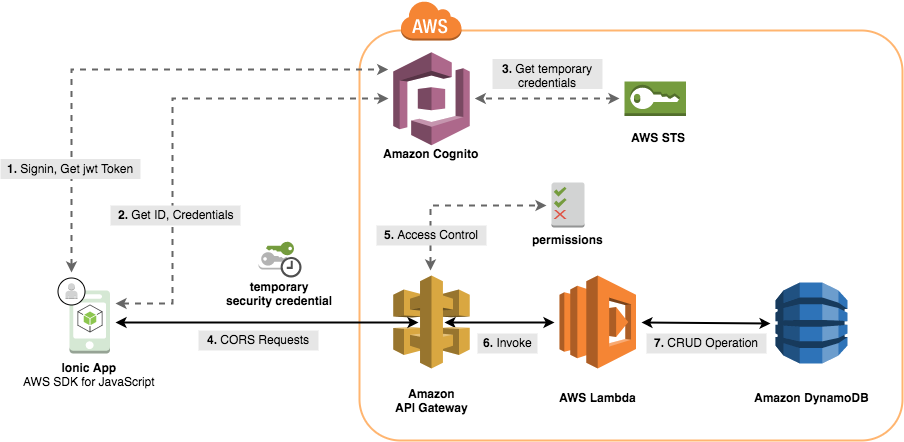
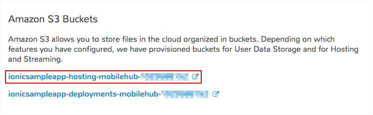
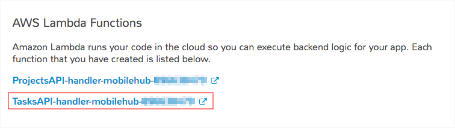
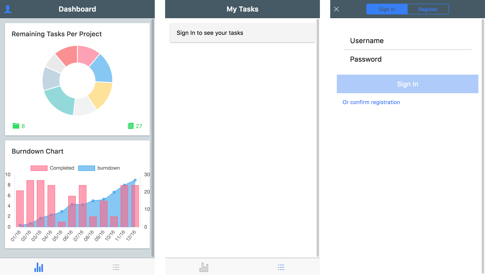
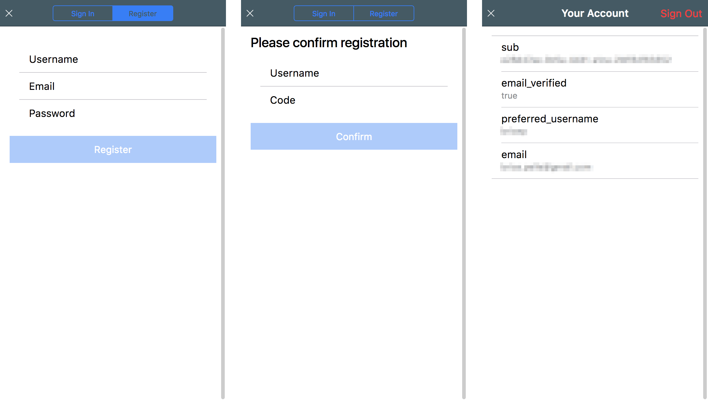
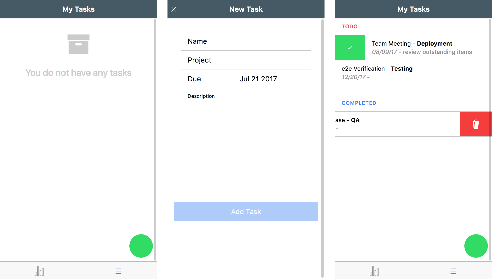

# AWS Mobile Ionic Sample App

### Quicklinks
 - [Getting started](#getting-started)
 - [Building and deploying](#building-and-deploying)
 - [Updating your Lambda Function](#updating-your-lambda-function)
 - [Advanced Usage: Using the Sign-up, Login and Sigv4Http services in your application](#advanced-usage-using-the-sign-up-login-and-sigv4http-services-in-your-application)
   - [Making signed requests for Unauthenticated Users (guests)](#making-signed-requests-for-unauthenticated-users-guests)
   - [Adding support for Authenticated Users](#adding-support-for-authenticated-users)


### Architecture Overview

Bootstrap an application built with [Ionic v2](https://ionicframework.com/) on AWS. Ionic is a JavaScript framework that uses [Angular](https://angular.io/) and [Apache Cordova](https://cordova.apache.org/) to run natively on mobile devices. The app will allow users to create, view, update, and delete project tasks. Users will also be able to sign-up and login to gain access to authorized AWS resources. The app will also provide guests access that will allow users which haven't logged-in to view a summary in a task dashboard.



AWS Services used:
* Amazon Cognito User Pools
* Amazon Cognito Federated Identities
* Amazon API Gateway
* AWS Lambda
* Amazon DynamoDB
* Amazon S3
* Amazon CloudFront

### Prerequisites

* [AWS Account](https://aws.amazon.com/mobile/details/)
* [NodeJS](https://nodejs.org/en/download/) with [NPM](https://docs.npmjs.com/getting-started/installing-node)
* [AWS CLI](http://docs.aws.amazon.com/cli/latest/userguide/installing.html)
* [Ionic CLI](https://ionicframework.com/docs/cli/)

## Getting started

First clone this repo: `git clone https://github.com/awslabs/aws-mobile-ionic-sample`

### Backend setup

1. Set up your AWS resources using AWS Mobile Hub by clicking the button below:

    [](https://console.aws.amazon.com/mobilehub/home?#/?config=https://github.com/awslabs/aws-mobile-ionic-sample/blob/master/backend/import_mobilehub/ionic-sample-app.zip)

1. Update the preselected name of your project if necessary and take note of the region in which your resources are created in. Press **Import project**.

### Client setup


1.  Before proceeding further, in the Mobile Hub console click the **Cloud Logic** tile and ensure that the API deployment status at the bottom shows **CREATE_COMPLETE** (_this can take a few moments_).

1.  Click **Configure** on the left hand bar of the console and select the **Hosting and Streaming tile**.

1.  At the bottom of the page click **Download aws-config.js file**. Copy this file into the `./aws-mobile-ionic-sample/client/src/assets/` folder of the repo you cloned.

    * Alternatively, click **Resources** on the left hand bar and in the **Amazon S3 Buckets** tile, copy the name of your _hosting_ bucket.

      

      Then, using the CLI:

      ```bash
      aws s3api get-object --bucket <YOUR_BUCKET_NAME> --key aws-config.js ./aws-mobile-ionic-sample/client/src/assets/aws-config.js
      ```

1.  Navigate into  `./aws-mobile-ionic-sample/client` and run:

    ```bash
    npm install
    ionic serve
    ```

    Done!

### Bootstrapping with sample data (Optional)

You can bootstrap your application with with some default tasks:

1.  On the left hand side of the Mobile Hub console for your project, select the the **Resources** tab. On the **AWS Lambda Functions** tile, copy the name of your _TasksAPI-handler_

    

2.  Using the AWS CLI, run the following command with your Lambda function name and the region your resources were deployed in (e.g.: us-east-1)

    ```bash
    sh ./aws-mobile-ionic-sample/bootstrap/run.sh <YOUR_LAMBDA_FUNCTION> <REGION>
    ```

### Application Walkthrough


1.  Open a browser to `http://localhost:8100` to see your running sample app on the **Dashboard** page. If you chose to bootstrap your app, you will see a summary of existing tasks, and a burndown chart. The data is pulled from the _Projects_ DynamoDB table which all users (guest and authenticated) have read-only access to. All users have access to this page. However, as a guest user, you do not have access to the **My Tasks** page.

    

1.  Click the blue **_User icon_ in the upper right hand corner** to create a new account. Select the **Register** tab, and type in a username, password, and email address.

1.  You should receive a 6-digit verification code in your email inbox. Type this into the screen and click **Confirm**.

1.  Now that you are signed in, you can click the _User icon_ (which is now green) on the Dashboard page to view some information about your account. You can also sign out from this view.

    

1.  As an authenticated user you can now see details of the tasks you own. Click the **_horizontal lines_ icon in the bottom** navigation bar to get to the **My Tasks** screen. Click the green Floating Action Button at the bottom to bring up a modal where you can enter your task information.

1.  On the **My Tasks** screen you can right swipe a "TODO" task, and click the green check button to complete it. You can left swipe a "TODO" or a "COMPLETED" task, and click the red trash button to delete it. Each time you manage a task, data is updated in the DynamoDB _Tasks_ table and summarized in the _Projects_ table.

    

1.  Return to the **Dashboard** to see an updated view of the projects and the burndwon chart. When you manage a task, the dashboard data is updated on the client side without fetching it from the backend. You can refresh the dashboard with backend data at any time by pulling down on the page.

1.  You can click on the _User Icon_ to sign out from the app. You can still see the dashboard as an unauthenticated user and pull down the page to refresh it.

## Building and deploying

The following steps outline how you can build and deploy the application to a hosted webserver with global CDN on AWS (using S3 and CloudFront) created by the Import phase above:

1.  Navigate to `./aws-mobile-ionic-sample/client` and build for production by running:

    ```bash
    npm run build
    ```

2.  Copy everything within the produced `./aws-mobile-ionic-sample/client/www` directory to the S3 bucket that was created earlier. You can do this one of two ways:

    - Via the Mobile Hub console select the **Hosting and Streaming** section of your project, click **Manage Files** at the bottom which will open the S3 console. Click **Upload** and then **Add files** selecting everything inside the `./aws-mobile-ionic-sample/client/www` directory. Press **Upload**.

    - Via the AWS CLI, using the name of the hosting bucket (see [Client Setup](#client-setup) for instructions on how to get the bucket name)

      ```bash
      aws s3 cp --recursive ./aws-mobile-ionic-sample/client/www s3://<YOUR_BUCKET_NAME>
      ```

3. To view your website, in the Mobile Hub console select the **Hosting and Streaming** section and click the **View from S3** to see your page immediately or **View from CloudFront** to see using a CDN (_note: this might be immediate or take up to an hour_).

## Updating your Lambda Function

The sample application invokes a simple Lambda function to handle backend requests and make CRUD operations to DynamoDB. You may wish to modify the function to change the behavior of your backend. The steps below outline how to do so for a Node.js [runtime](http://docs.aws.amazon.com/lambda/latest/dg/current-supported-versions.html).

1.  This sample app uses 2 Lambda functions that run the same code. On the left hand side of the Mobile Hub console for your project, select the the **Resources** tab. The name of the Lambda functions are listed in the **AWS Lambda Functions** tile.

1.  In a terminal, navigate to `./aws-mobile-ionic-sample/backend/lambda`. Notice that the directory only includes `index.js`, `lambda-archive.zip`, and no `package.json`. This is because the current function's only dependency is on the AWS SDK for Javascript (`aws-sdk` npm package) which is available in the AWS Lambda Node.js runtime.

1.  Make updates to `index.js` and add other files as necessary. Install your npm requirements using the `npm install --save` command. This installs your requirements in the `node_modules` directory and saves your configuration in `package.json` (the file is created if it does not exist).

1.  Package your application (along with the `node_modules` folder) and update the function

    ```bash
    zip -r lambda-archive.zip .
    aws lambda update-function-code --function-name <YOUR_LAMBDA_FUNCTION> --region <REGION> --zip-file fileb://lambda-archive.zip
    ```

    Replace the `<YOUR_LAMBDA_FUNCTION>` with your Lambda function name and `<REGION>` with name of the region your resources were deployed in.

Alternatively you could click the Lambda function resource in the Mobile Hub console which opens the Lambda console and press the **Upload** button on that page to upload the `lambda-archive.zip` file.

## Advanced Usage: Using the Sign-up, Login and Sigv4Http services in your application

The services implemented in this demo app can easily be added to any Ionic project to make signed requests towards API Gateway, and to handle user sign-up and login. The sections below highlight how to do so.

### Making signed requests for Unauthenticated Users (guests)


1.  Clone this repo, then create a new ionic app and navigate to its directory

    ```bash
    git clone https://github.com/awslabs/aws-mobile-ionic-sample
    ionic start demo tabs
    cd ./demo
    ```

1.  Copy the required files from the cloned github repo

    ```bash
    cp ../aws-mobile-ionic-sample/client/webpack.config.js .
    cp ../aws-mobile-ionic-sample/client/src/app/auth.service.ts ./src/app/
    cp ../aws-mobile-ionic-sample/client/src/app/sigv4.service.ts ./src/app/
    cp ../aws-mobile-ionic-sample/client/src/app/app.config.ts ./src/app/
    ```

1.  Update the project dependencies by running the npm commands:

      ```bash
      npm install --save --save-exact amazon-cognito-identity-js@1.19.0
      npm install --save aws4 querystring-browser
      npm install --save-dev --save-exact typescript@2.2.2
      npm install --save-dev @types/node @types/aws4
      ```

    Edit `./package.json`, adding this line above the `name` field:

      ```json
      "config": { "ionic_webpack": "./webpack.config.js" },
      ```

    This directs the ionic build script to use our webpack configuration in which the `querystring` alias is redefined.

1.  In order to use the new services in the app, you need to register them as providers in `./src/app/app.module.ts`.

    * Edit `./src/app/app.module.ts` and add the following imports:

      ```typescript
      import { AwsConfig } from './app.config'
      import { AuthService, AuthServiceProvider } from './auth.service'
      import { Sigv4Http, Sigv4HttpProvider } from './sigv4.service'
      import { HttpModule } from '@angular/http' // sigv4.service dependency
      ```

    * Modify the `imports` array. Update the `IonicModule.forRoot` statement to load the AWS configuration and add `HttpModule` as an import:

      ```typescript
      imports: [
        BrowserModule,
        IonicModule.forRoot(MyApp, new AwsConfig().load()),
        HttpModule
      ],
      ```

    * At the top of the `providers` array, add the following statements:

      ```typescript
      AuthService, AuthServiceProvider,
      Sigv4Http, Sigv4HttpProvider,
      ```

1. Save the file.

1.  Download the `aws-config.js` file from your Mobile Hub S3 bucket and place it in the `./src/assets` directory.

    * Using the following commands

      ```bash
      aws s3api get-object --bucket <YOUR_BUCKET_NAME> --key aws-config.js ./src/assets/aws-config.js
      ```

      (Replace `<YOUR_BUCKET_NAME>` with the name of the streaming bucket created in your Mobile Hub project)

    * Modify `./src/index.html`, adding the following lines right above `<script src="cordova.js"></script>`

      ```html
      <script src="https://sdk.amazonaws.com/js/aws-sdk-2.92.0.min.js"></script>
      <script src="assets/aws-config.js"></script>
      ```

1.  You can now make signed requests to your endpoints. Update the home page to make a requests to the `ProjectsAPI` as a guest user (replace `ProjectsAPI` with the name of your own if you decide to use a different name in the Mobile Hub console for the Cloud Logic API).

    * Change `./src/pages/home/home.ts` to:

      ```typescript
      import { Component } from '@angular/core';
      import { NavController } from 'ionic-angular';

      import { Sigv4Http } from '../../app/sigv4.service'
      import { Config } from 'ionic-angular'
      import { AuthService } from '../../app/auth.service'
      import { Observable } from 'rxjs/Observable'
      import 'rxjs/add/operator/map'
      import 'rxjs/add/operator/concatAll'
      import 'rxjs/add/operator/share'


      @Component({
        selector: 'page-home',
        templateUrl: 'home.html'
      })
      export class HomePage {

        private endpoint:string
        private projects:any = []

        constructor(public navCtrl: NavController, private sigv4: Sigv4Http, private auth: AuthService, private config: Config) {
          this.endpoint = this.config.get('APIs').ProjectsAPI
        }

        ionViewDidLoad() {
          let obs = this.auth.getCredentials().map(creds => this.sigv4.get(this.endpoint, 'projects', creds)).concatAll().share()
          obs.subscribe(resp => {
            this.projects = resp.json().projects
          })
        }
      }
      ```

    * Replace the content of `./src/pages/home/home.html` with the below to show the fetched data:

      ```html
      <ion-header>
        <ion-navbar>
          <ion-title>Home</ion-title>
        </ion-navbar>
      </ion-header>

      <ion-content padding>
        <ion-list>
          <button ion-item *ngFor="let p of projects; let idx = index">
            {{idx}} - {{ p.projectId }} @ {{p.month}}. Total: {{p.added - p.completed}}
          </button>
        </ion-list>
      </ion-content>
      ```

1. Save the changes to the files above.

1. You can now run the application. Requests made using the sigv4Http service will be signed with the unauthenticated user's credentials.

   ```bash
   ionic serve
   ```

### Adding support for Authenticated Users

The ability to let users sign-up with a registration process and login to the site is provided in this starter code. The functionality to do this is implemented in the `Auth` service. You can easily set up the forms and code needed to interact with the user to gather necessary information.

1.  Copy the `login` and `logout` modal components from the github repository

    ```bash
    mkdir src/modal
    cp -R ../aws-mobile-ionic-sample/client/src/modal/login ./src/modal
    cp -R ../aws-mobile-ionic-sample/client/src/modal/logout ./src/modal
    ```

1.  Add `login` and `logout` to the list of declarations and entry components in `./src/app/app.module.ts`:

    * Add to the imports:

      ```typescript
      import { LoginModal } from '../modal/login/login'
      import { LogoutModal } from '../modal/logout/logout'
      ```

    * At the top of the `declarations` **_and_** `entryComponents` arrays, add:

      ```typescript
      LoginModal,
      LogoutModal,
      ```

1. Save the file.

1.  Update `./src/pages/home/home.ts` to add functionality to open the modal:

    * At the top of the file, add `ModalController` and the modals to the list of imports

      ```typescript
      import { ModalController } from 'ionic-angular'
      import { LoginModal } from '../../modal/login/login'
      import { LogoutModal } from '../../modal/logout/logout'
      ```

    * Update the constructor to inject the `ModalController` service by replacing it with:

      ```typescript
      constructor(public navCtrl: NavController, private sigv4: Sigv4Http, private auth: AuthService, private config: Config, public modalCtrl: ModalController) {
        this.endpoint = this.config.get('APIs').ProjectsAPI
      }
      ```

    * Add the `openModal` method and the `userColor` getter, a helper that gives a color based on the user status (you can add these right below the constructor from the last step):

      ```typescript
      openModal () {
        let modal = this.modalCtrl.create(this.auth.isUserSignedIn() ? LogoutModal : LoginModal)
        modal.present()
      }

      get userColor():string { return this.auth.isUserSignedIn() ? 'secondary' : 'primary' }
      ```

1. Save the file.

1.  Update `./src/pages/home/home.html` to add a button to open the modal. Under `<ion-title>`, Add:

    ```html
    <ion-buttons start>
      <button ion-button icon-only clear (click)="openModal()" [color]="userColor">
        <ion-icon name="person"></ion-icon>
      </button>
    </ion-buttons>
    ```

1.  Save the file and run `ionic serve` to launch your site again.

1.  You can now register and sign in or sign out from your app. When a user is signed in, The `Auth` service will return the credentials of that user and requests made via the `Sigv4Http` service will be signed with those credentials.
